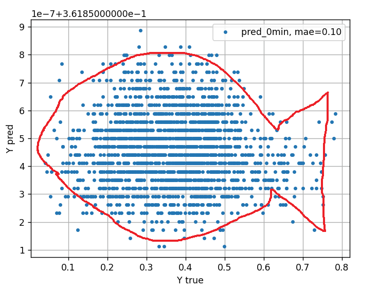

# About

## Why GlucoPred?

## Why is it important?

## ...

# Data

## Empatica

About empatica band + signals examples

* BVP
* EDA
* Accelerometer
* Temperature

## CGM

About CGM device + signal example

# Methods

## Features based

## Time series based

# Results

## Feature based

## Time series based

# Team

## Who we are

